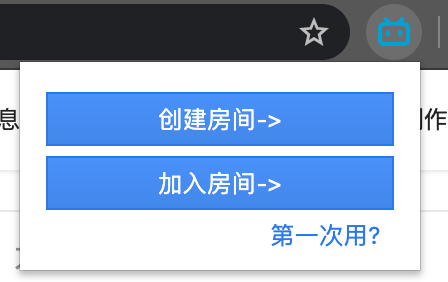
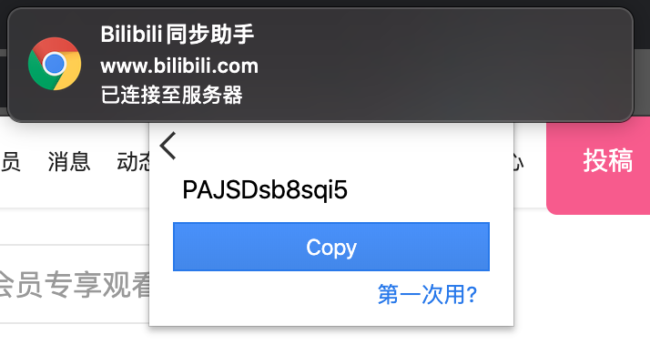

# 使用说明

本插件可以提供b站视频状态（播放、暂停）和视频进度同步功能。至少有两位用户时，才能体验插件的功能。用户可分为房主（控制端，控制其他用户的状态）和普通用户（接收端，接收主机的状态）。

如果你想作为房主，请阅读[房主篇](#房主篇)，如果你想加入别人的房间，请阅读[用户篇](#用户篇)。

目前为预览版本，插件和同步服务器功能不稳定。如出现失效的情况，请刷新页面或重建房间。

## 房主篇

1. 打开b站某个视频
2. 点击插件栏中b站助手的插件图标，此时位于

3. 点击`创建房间->`，你会收到提示，已经连接服务器，此时就可以等待其他用户连入

4. 点击`Copy`按钮，复制id至剪贴板，把它分享给你的朋友。 
5. 如果不想作为房主，点击插件左上角`<`返回按钮即可

## 用户篇

1. 打开b站某个视频
2. 点击插件栏中b站助手的插件图标，此时位于

3. 拿到朋友的id，输入输入框中，点击`Join`

4. 如果不想进行同步，点击插件左上角`<`返回按钮即可 

## FAQ

1. 提示服务器错误怎么办？
服务器崩掉了，联系我看下服务器有什么问题。
2. 作为房主，我跳转/暂停/开始了，朋友的状态没改变怎么办？
- 重启大法：你和朋友们先点击后退`>`按钮，然后刷新页面，重建房间加入尝试一下。
- 目前已知房主在跳转后，立即点击空格暂停，用户不会暂停